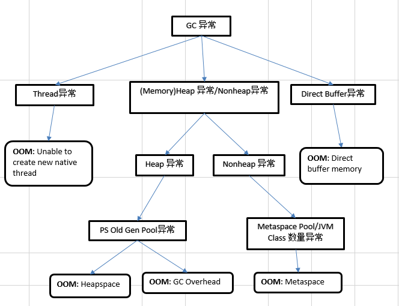
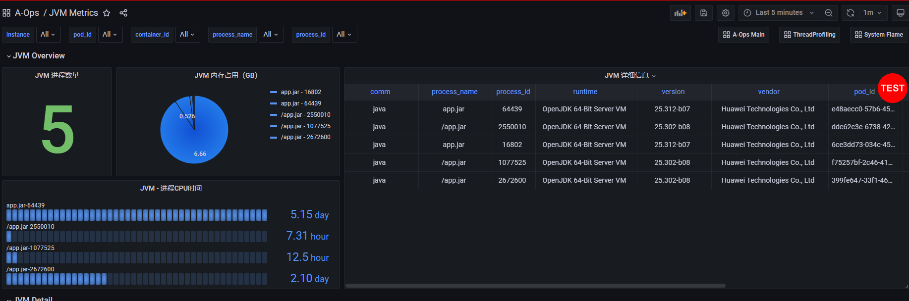
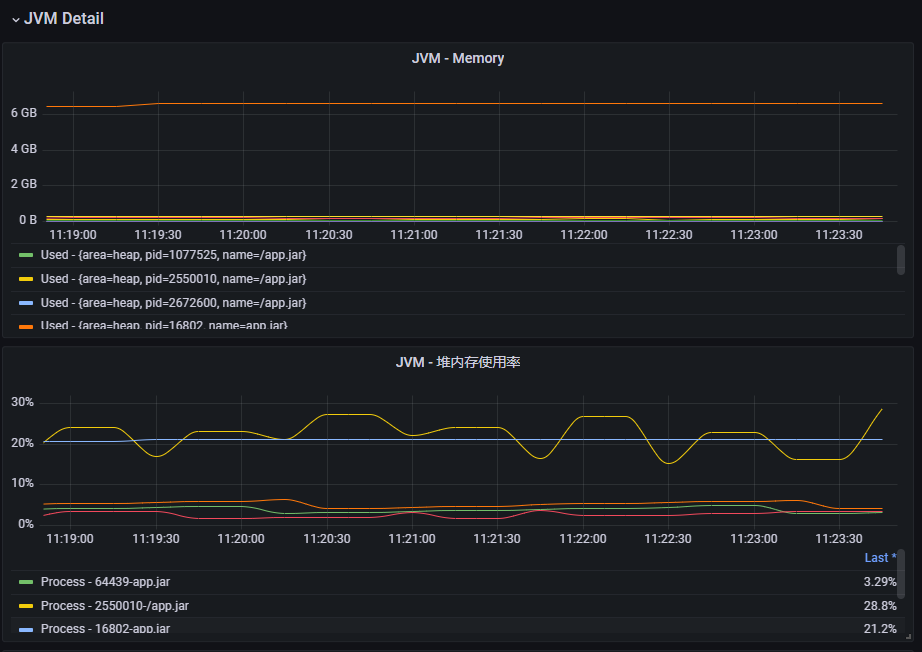
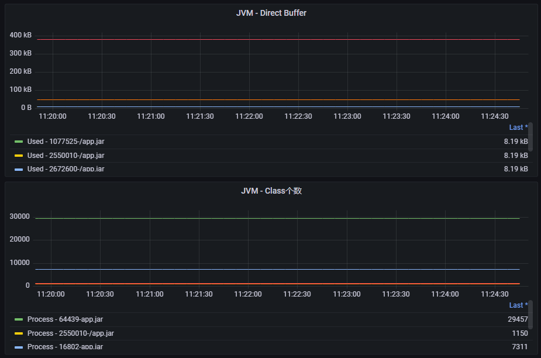
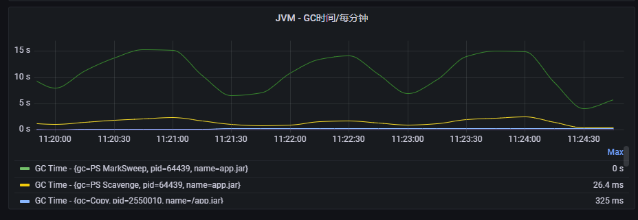
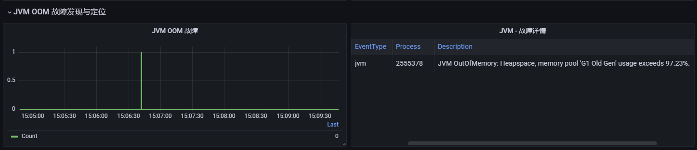

# JVM OOM 诊断
## 背景
当 JVM 内存严重不足时，就会抛出 java.lang.OutOfMemoryError 错误。表-1 给出了 JVM OOM 9种常见类型及其对应的详细信息。实际生产环境中，每种类型错误或许可能存在上百种原因，往往很难准确定位。

常见的 JVM OOM 分析工具如 `jmap`、`jcmd`、`jps` 等工具可以将内存信息 dump 下来，并利用可视化工具，如 `VisualVM`，分析内存潜在问题，但是此方式存在底噪高、无法在线部署等原因，依然无法准确找到线上 OOM 问题的原因。

当前 gala-gopher 基于 jvmti 接口，实现实时 JVM 内存数据采集，同时结合 gala-anteater 故障诊断能力，实现分钟级 JVM OOM 错误故障诊断并上报异常。

_表-1. JVM OOM 9种常见类型 & 当前诊断能力范围_
| 序号 | 类型                                    | 详情                                                                                                                             | 诊断范围            |
|----|---------------------------------------|--------------------------------------------------------------------------------------------------------------------------------|-----------------|
| 1  | Java heap space                       | 堆内存（Heap Space）没有足够空间存放新创建的对象                                                                                                  | 支持               |
| 2  | GC overhead limit exceeded            | 当 Java 进程花费 98% 以上的时间执行 GC，但只恢复了不到 2% 的内存，且该动作连续重复了 5 次                                                                        | 支持               |
| 3  | Permgen space                         | 该错误表示永久代（Permanent Generation）已用满                                                                                              | 支持（JDK1.8后不存在该类型故障） |
| 4  | Metaspace                             | JDK 1.8 使用 Metaspace 替换了永久代（Permanent Generation），该错误表示 Metaspace 已被用满，通常是因为加载的 class 数目太多或体积太大。                               | 支持               |
| 5  | Unable to create new native thread    | 每个 Java 线程都需要占用一定的内存空间，当 JVM 向底层操作系统请求创建一个新的 native 线程时，如果没有足够的资源分配就会报此类错误                                                     | 支持               |
| 6  | Out of swap space                     | 该错误表示所有可用的虚拟内存已被耗尽。虚拟内存（Virtual Memory）由物理内存（Physical Memory）和交换空间（Swap Space）两部分组成。当运行时程序请求的虚拟内存溢出时就会报 “Outof swap space?” 错误 | 不支持              |
| 7  | Requested array size exceeds VM limit | JVM 限制了数组的最大长度，该错误表示程序请求创建的数组超过最大长度限制。                                                                                         | 不支持              |
| 8  | Kill process or sacrifice child       | 有一种内核作业（Kernel Job）名为 Out of Memory Killer，它会在可用内存极低的情况下“杀死”（kill）某些进程。                                                        | 不支持              |
| 9  | Direct buffer memory                  | Java 允许应用程序通过 Direct ByteBuffer 直接访问堆外内存，Direct ByteBuffer 的默认大小为 64 MB，一旦使用超出限制，就会抛出 Directbuffer memory 错误。                  | 支持               |


## gala-gopehr JVM 探针数据采集

gala-gopher 采用 Java Agent 技术，实现实时监控和采集 JVM 内存数据，主要技术细节请参考：[jvmprobe](https://gitee.com/openeuler/gala-gopher/blob/master/src/probes/extends/java.probe/jvm.probe/readme.md)。

当前采集的数据，基本覆盖了 JVM 中各个不同内存区域的信息，能够实时反映当前 JVM 内存使用情况。表-2给出了不同内存区域主要采集的指标数据。全部采集的指标数据参考：[jvm监控](https://gitee.com/openeuler/gala-docs/blob/master/gopher_tech.md#jvm%E7%9B%91%E6%8E%A7)。

_表-2：JVM 各个内存区域采集的主要指标及其含义_
| 类型       | 范围                 | 主要指标                                  |
|----------|--------------------|---------------------------------------|
| Heap     | Yong Generation    | mem_bytes_init：初始化大小                  |
|          |                    | mem_bytes_used：堆内存的使用量                |
|          |                    | mem_bytes_max：堆内存的最大值                 |
|          |                    | mem_pool_bytes_used：各个内存池使用量          |
|          | Old Generation     | mem_pool_bytes_max：各个内存池的容量           |
| Non-Heap | Metaspace/ Permgen | class_current_loaded：当前加载的class个数     |
|          |                    | class_loaded_total：总共加载的class个数       |
|          | Direct ByteBuffer  | buffer_pool_used_bytes：使用的bytes       |
|          |                    | buffer_pool_used_buffers：使用的总buffer个数 |
|          |                    | buffer_pool_capacity_bytes：容量         |
|          | Thread             | threads_current：当前线程的个数               |
|          |                    | threads_peak：线程峰值个数                   |
| GC       | Garbage Collection | gc_coll_secs_count: GC总时间             |
|          |                    | gc_coll_secs_sum: GC总次数               |

## gala-anteater JVM OOM 故障诊断
基于上述 JVM 各个内存区域数据，我们基于 gala-anteater 故障诊断能力，构建 JVM OOM 故障诊断及异常事件上报。

当前的技术思路主要是 Tree-based 模型 + 异常检测算法（如：n-sigma），图-1给出了该技术方案的细节。首先，引起 JVM OOM 现象最直接的原因是 GC 动作失效，GC 无法释放足够的内存空间，导致 JVM 内存不足，进而引起 OOM。其次，不同内存区域引起 OOM 的原因各不相同。因此基于不同的内存区域，划分成不同的异常检测场景，各个场景独立完成故障诊断。

基于上述思路，构建了树形模型，树中一个叶子节点表示一种 OOM 类型；非叶子节点表示故障触发条件，通过构建异常检测算法，进行故障检测，来判断当前非叶子节点是否存在故障。每条通往叶子节点的路径，表示该类 OOM 故障需要同时满足的条件，表-3总结了每条路径需要满足的基本准则。

因此该设计的主要好处是模型可解释性强，同时各个模块之间相互独立，后续模型更新，只需针对部分模块进行更新即可。

_图-1. JVM OOM 5种类型故障诊断 & 异常上报_


_表-3：每条通往叶子节点的路径需要满足的基本准则_
| 叶子节点的类型| 基本准则|
|-|-|
| OOM: Heapspace| 1. Heap的使用量，持续上升，使用率超90%；<br/>2. Heap中PS Old Gen Pool持续上升，使用率超过90%;<br/>3. Java Class 数量没有明显变化；<br/>4. 频繁进行GC操作，GC时间和次数明显超过之前；GC数量和时间存在N倍升高（异常）（n-sigma）；<br/>5. JVM Thread数量没有明显变化；<br/>6. PS Old Gen Pool Collection使用量持续上升；使用率超90%(同2)；|
| OOM: GC Overhead| 1. Heap的使用量，持续上升，使用率至80%；<br/>2. Heap中PS Old Gen Pool持续上升，使用率超过90%;<br/>3. Java Class 数量没有明显变化；<br/>4. 频繁进行GC操作，GC时间和次数明显超过之前；GC数量和时间存在N倍升高（异常）（n-sigma）；<br/>5. JVM Thread数量没有明显变化；<br/>6. PS Old Gen Pool Collection使用量持续上升；使用率超90%(同2)；|
| OOM: Metaspace| 1.Nonheap的使用量，持续上升，使用率超过90%；<br/>2.Metaspace Pool持续上升，使用率超过90%；<br/>3.JVMclass数量持续上升；<br/>4.Compressed Class Space Pool持续上升，使用率超过90%；<br/>5.JVM Thread数量没有明显变化；<br/>6.频繁进行GC操作。|
| OOM: Unable to create new native thread | 1. 频繁进行GC操作，GC时间和次数明显超过之前；GC数量和时间存在N倍升高（异常）（n-sigma）;<br/>2. JVM Thread数量持续上升，到达指定阈值；<br/>3. 其他指标正常；|
| OOM: Direct buffer memory| 1. 频繁进行GC操作，GC时间和次数明显超过之前；GC数量和时间存在N倍升高（异常）（n-sigma）;<br/>2. Buffer Pool的使用量，持续上升，到达阈值；<br/>3. 其他指标正常；|

## 实验细节
实验通过构造 JVM OOM 上述 5 种主要故障，端到端测试 JVM OOM 故障诊断能力。

构造故障的 Java 代码参考：[JavaOOMHttpServer](code/JavaOOMHttpServer.java)。

1. 编译代码：
```
javac -cp '.:/usr/share/java/javassist.jar' JavaOOMHttpServer.java
```
2. 指定堆、MaxMetaspaceSize、MaxDirectMemorySize的大小，并运行：
```
java -Xmx100m -XX:MaxMetaspaceSize=100m -XX:MaxDirectMemorySize=2500 -cp '.:/usr/share/java/javassist.jar' JavaOOMHttpServer &
```
3. 故障注入，当前代码支持 5 种常见 OOM 故障注入，执行如下每条命令，对应一种类型的故障注入：
  * OOM Heapspace: `curl http://localhost:8000/heapspace`
  * OOM GC Overhead: `curl http://localhost:8000/gcoverhead`
  * OOM Metaspace: `curl http://localhost:8000/metaspace`
  * OOM Unable to create new native thread: OOM Direct buffer memory: `curl http://localhost:8000/thread`
  * OOM Direct buffer memory: `curl http://localhost:8000/buffer`

## 测试结果
如下给出我们搭建环境中相关指标数据，及其故障诊断的结果和异常上报的结果。

1. gala-gopher主要采集的指标信息汇总


2. 堆内存相关的指标数据及堆内存使用率


3. 堆外内存指标数据和Metaspace中class的个数


4. 每个进程GC所花费的平均时间


5. JVM OOM诊断能力检测到堆满异常，并上报，上报数据显示堆中G1 Old Gen使用率超过97.23%。
